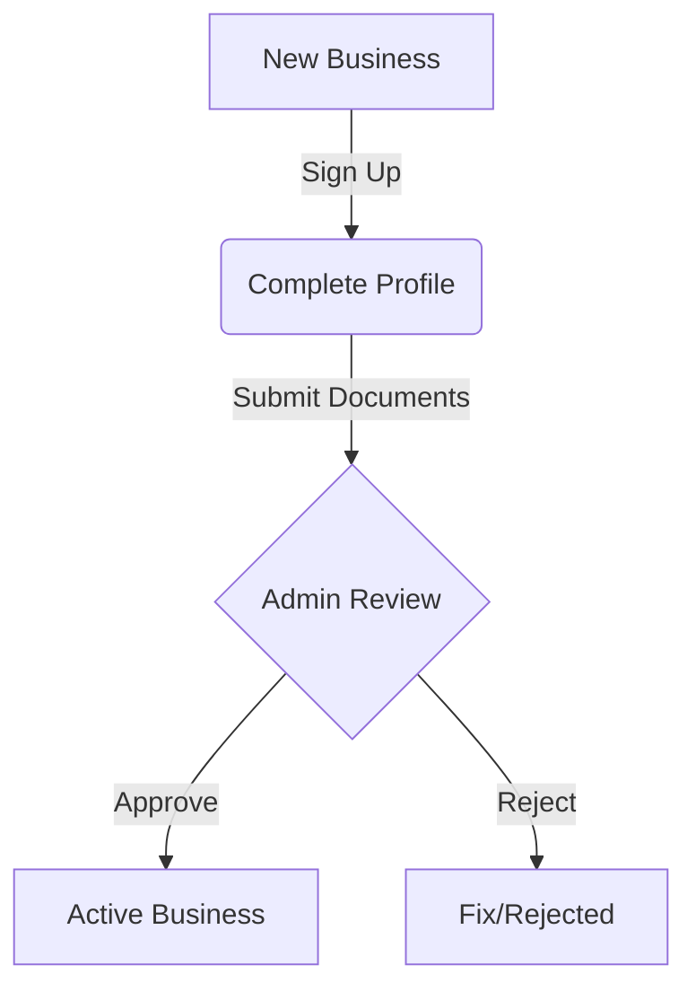
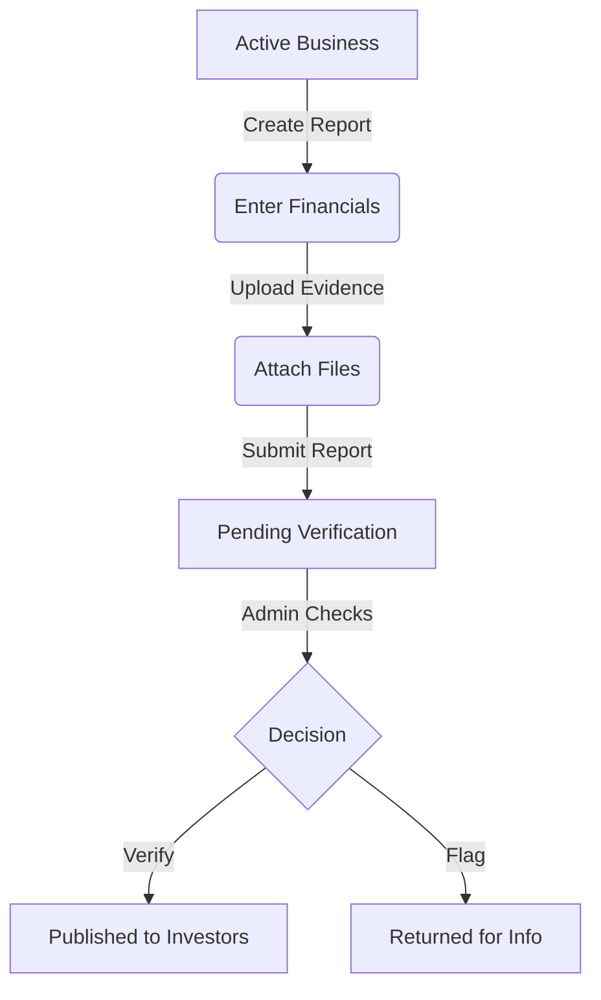

# Product Design & System Specification (Phase 0)

## 1. User Roles & Descriptions

*   **Admin**: The platform owner/operator. Responsible for vetting businesses, managing disputes, and overseeing system integrity.
    *   *Role*: "The Trust Anchor"
    *   *Key Capabilities*: Approve businesses, flag reports, manage users, view all data.
*   **Business**: An entity (company/startup) seeking investment or reporting to existing investors.
    *   *Role*: "The Data Source"
    *   *Key Capabilities*: Create profile, submit financial reports, upload evidence, respond to queries.
*   **Investor**: An individual or entity with capital deployed.
    *   *Role*: "The Data Consumer"
    *   *Key Capabilities*: View portfolio, read reports, download evidence, track audit status.

## 2. Data Ownership & Trust Boundaries

### Data Access Matrix

| Data Type | Business | Investor | Admin |
| :--- | :--- | :--- | :--- |
| **Business Profile** | **Write / Read** (Own) | **Read Only** (Linked) | **Write / Read** (All) |
| **Financial Reports** | **Write** (Submit) | **Read Only** (Linked) | **Flag / Verify** |
| **Evidence (Files)** | **Write** (Upload) | **Read Only** (Linked) | **Flag / Verify** |
| **Audit Logs** | **Read Only** (Own) | **Read Only** (Linked) | **Write** (System) |

### Trust Boundaries (Strict Rules)
1.  **Investors cannot edit Business data.** No exceptions.
2.  **Businesses cannot delete historical reports.** Once submitted, reports are immutable or strictly versioned with audit trails.
3.  **Investors cannot see other Investors.** Portfolio privacy is paramount.
4.  **Unlinked Investors cannot see granular Business data.** Only potentially public summary data is visible until a relationship is established.

## 3. Allowed vs Forbidden & Data Rules

### Forbidden 🚫
*   **Direct Investor-Business Messaging**: To prevent harassment or side-channel deals, communication should be mediated or structured via Admin/Platform.
*   **Retroactive Alteration**: Businesses cannot silently change numbers in past reports. A new version must be submitted ("Restatement").
*   **Admins Forging Data**: Admins can *flag* or *annotate* data as suspicious, but should not have a UI to *edit* the raw financial numbers submitted by the business (preserves non-repudiation).

### Allowed ✅
*   **Admins Freezing Accounts**: For suspicious activity or non-compliance.
*   **Businesses Appending Corrections**: Creating a V2 of a report.
*   **Investors Requesting Specific Data**: Via a structured "Request Info" button (mediated).

## 4. MVP Scope (Minimum Viable Product)

**Target Strategy: "The Trust Loop"**
*Verified Business -> Submits Report -> Uploads Evidence -> Investor Sees Updates.*

### Included in MVP
1.  **Auth**: Sign up/in for all 3 roles (Email/Password).
2.  **Profiles**:
    *   Business: Name, Description, Location, "Verified" status.
    *   Investor: Name, Portfolio view.
3.  **Relationships**: Admin manually links Investor to Business (Simple 1:N or N:M).
4.  **Reporting**: Business submits monthly text/number report (Revenue, Expenses, Cash, Burn Rate).
5.  **Evidence**: Business uploads PDF/Image proof for reports.
6.  **Dashboard**: Read-only timeline view for Investors.
7.  **Admin Panel**: Basic list views to Approve users and Link them.

### Excluded from MVP (Post-MVP)
1.  Payment processing / Escrow / Money transfer.
2.  Real-time Chat.
3.  Mobile App (Web responsive only).
4.  Advanced Analytics / Charts (Start with simple tables/cards).
5.  Automated Bank API feeds (Plaid, etc.).
6.  Blockchain integration (Keep it centralized for MVP).

## 5. User Flows

### Flow 1: Onboarding

### Flow 2: Reporting Cycle

## 6. Feature List (Technical)

1.  **Authentication Module**: Supabase Auth (Email + Password).
2.  **Role-Based Access Control (RBAC)**: Middleware to enforce the Data Access Matrix.
3.  **Onboarding Workflow**: Multi-step form with file upload for vetting.
4.  **Dashboard Shell**: Responsive layout with side navigation based on role.
5.  **Report Builder**: Form to input key metrics (Revenue, Expense, Cash-in-Bank) + File Upload.
6.  **Evidence Vault**: Secure storage (Supabase Storage) with RLS for receipts/statements.
7.  **Timeline Feed**: A chronological view of reports and audits for Investors.
